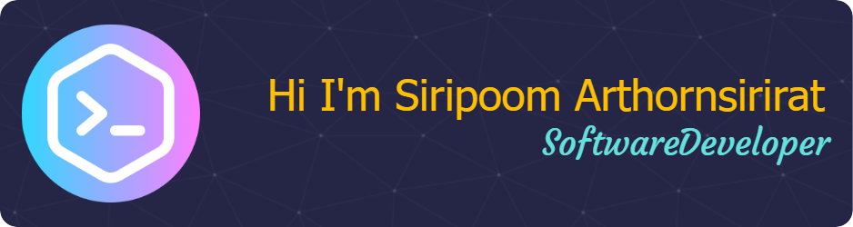

Hi! 👋

🔭 I’m currently freelance Dev.

📃 I'm currently learning and complete:
  
  📋 Languages
  
  
  
  
  
  
  
  
  
  📚 Frameworks, Platforms and Libraries
  
  
  
  

  💾 Databases
  
  
  
  
  
  ☁️ Hosting/SaaS
  
  
  
  
  
  
  
  💻 IDEs/Editors
  
  
  
  
  
  
  <!--⭐ Here are some projects that I'm working on:-->

📫 Contact me.
   

